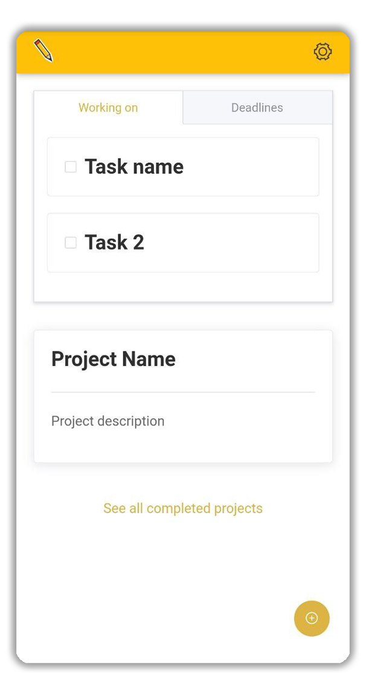
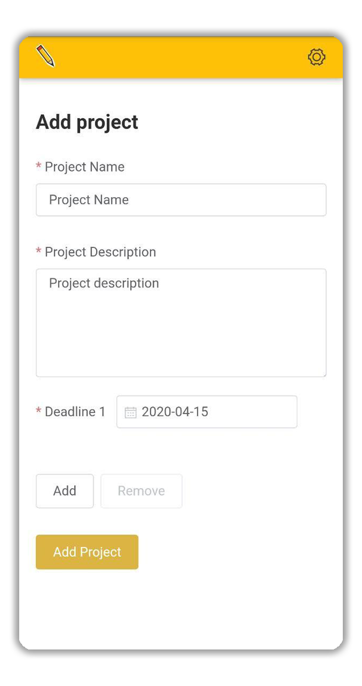
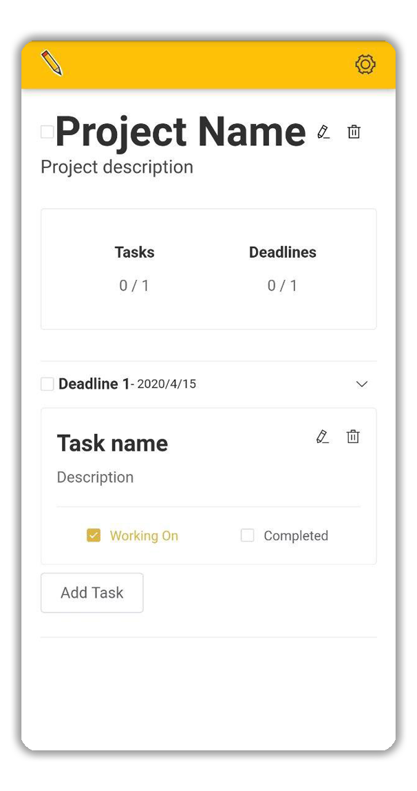
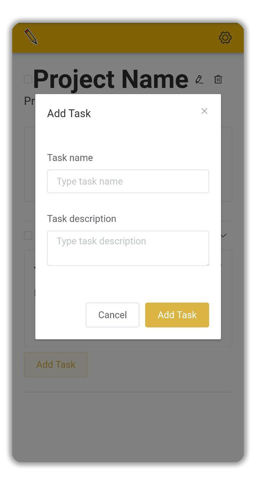

#  Projecting

## 📝 Description
Projecting is an easy and intuitive application, its purpose is to provide to beginner developers a tool to support them during the development of their projects.
By having all the projects in one place, allows to monitoring deadlines, tasks and other useful resources.

---

## 🖥️ Usage

The app is very simple:

- The **`homepage`** show main informations, like working on tasks, incoming deadline and active projects. <br>
By clicking `+` icon you can add another project.

- The **`add project`** page allows you to add a new project by defining some basics information, such as project name, description and deadlines.

- The **`project`** page show all detailed information about a project.
<br>
From this page you can also edit project information, and manage deadline's tasks.

- The **`add task`** form allows you to add a new task by define its name and description.
 





---

## 🎚️ Project setup

Available commands to work with this project:

```
// install all dependencies
yarn install

// compiles and hot-reloads for development
yarn serve

// compiles for production
yarn serve
```

---

## License
[This software is under MIT License](https://it.wikipedia.org/wiki/Licenza_MIT).
